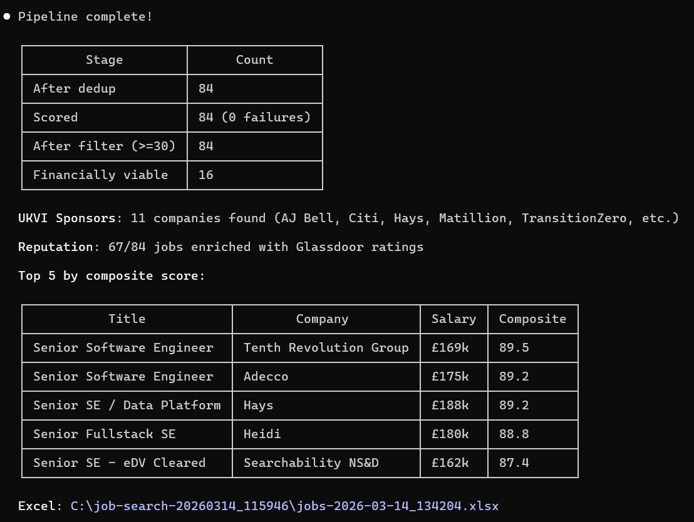
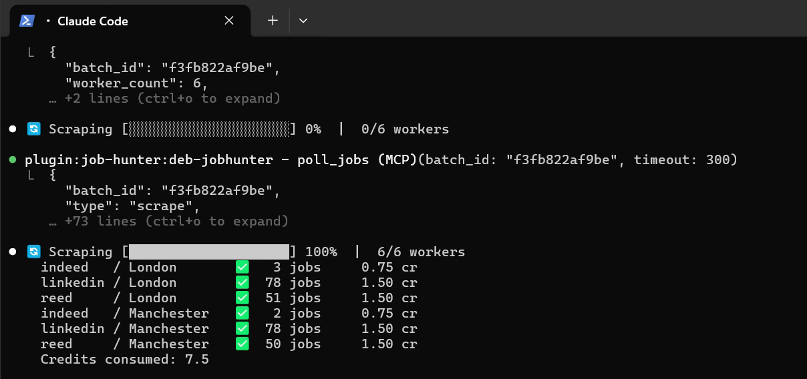
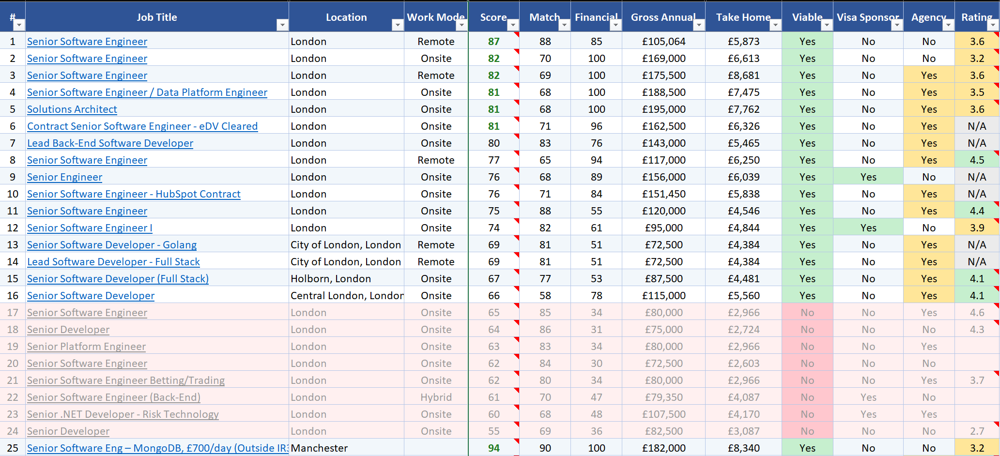
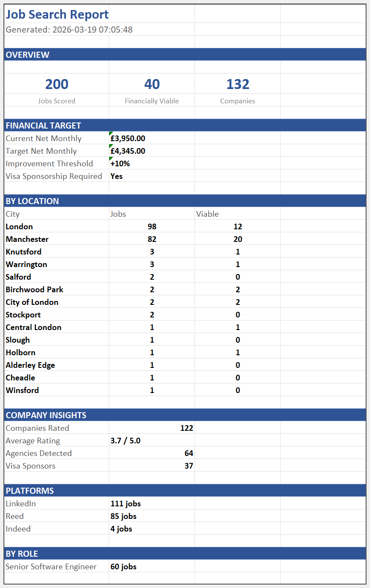

<div align="center">


# Job Hunter

**AI-powered job search for Claude Code**

Search 14 job platforms across UK and France. Score every listing against your profile — skills, salary, visa, commute — and export a professional Excel report.

*The job search autopilot recruiters don't want you to have.*

[](https://github.com/debytesio/claude-plugin-jobhunter)
[](LICENSE)
[](https://github.com/debytesio/claude-plugin-jobhunter/releases)
[]()
[]()

[](https://linkedin.com/company/debytes)
[](https://x.com/debytesio)
[](https://discord.gg/8BZZ2fQGhu)

</div>

<br>

<div align="center">
  
  <p><em>Full pipeline: 84 jobs scored, 16 financially viable, Top 5 ranked by composite score</em></p>
</div>

## Why Job Hunter?

Most job search tools stop at scraping. Job Hunter goes further — it brings **ATS-grade analysis** to your side of the table: the same requirements matching, skill extraction, and experience parsing that recruiters use, now working for you.

- **One command, 1,000+ jobs analysed** — parallel scraping across 14 platforms, deduplication, JD enrichment, and 8-dimension AI scoring
- **Real financial analysis** — country-specific tax, NI/social contributions, and commute costs calculated so you see your actual take-home before applying
- **Company intelligence** — employer ratings, visa sponsor verification (140k+ UKVI register), and recruitment agency detection built in
- **One command, full pipeline** — 450 jobs scraped, enriched, scored, and exported in under 10 minutes

## Quick Start

### 1. Install

```
/plugin marketplace add debytesio/claude-plugins
/plugin install job-hunter@debytes
```

### 2. Run

```
/job-hunter:find-jobs examples/job-expectations-example-gb.json
```

A sample resume and expectations file are included — try it out of the box. First run opens your browser to authenticate with DEB Cloud (free trial, no card required).

## How It Works

```
Expectations JSON
       |
       v
+-----------+   +-----------+   +-----------+   +-----------+
|  Scrape   |-->|  Dedup &  |-->|  Enrich   |-->|  Score    |
| 14 boards |   |  Filter   |   |  JDs      |   |  8 dims   |
+-----------+   +-----------+   +-----------+   +-----------+
                                                      |
       +----------------------------------------------+
       v
+-----------+   +-----------+   +-----------------------+
|  Company  |-->| Financial |-->|  Excel Report         |
|  Checks   |   | Analysis  |   |  5 sheets, 21 columns |
+-----------+   +-----------+   +-----------------------+
```

<div align="center">
  
  <p><em>Parallel scraping across 6 workers with real-time progress and credit tracking</em></p>
</div>

## Key Capabilities

| Capability | Description |
|------------|-------------|
| **JD Enrichment** | Fetches and parses full job descriptions — extracts requirements, tech stack, seniority signals, and years of experience |
| **8-Dimension Scoring** | Role, skills, requirements, experience, seniority, salary, location, visa — AI-scored per job |
| **ATS-Grade Matching** | Requirements coverage, tech stack overlap, and experience fit — the same analysis recruiters run on your CV |
| **Financial Viability** | Tax + NI + commute = real take-home per job, per country. Know before you apply. |
| **Company Checks** | Employer ratings, UKVI visa sponsor status, and agency detection — in one step |
| **Smart Dedup** | Cross-platform deduplication so the same job from 3 boards appears once |
| **Session Persistence** | Checkpoints at every step — resume interrupted searches automatically |
| **Multi-Country** | UK (GBP, PAYE/NI) and France (EUR, impot/cotisations) — more countries planned |

## Output

A polished Excel workbook with 5 sheets:

| Sheet | Content |
|-------|---------|
| **{Role Name}** | Top matches for each target role, ranked by composite score |
| **All Results** | Every scored listing, sorted by score |
| **Score Breakdown** | Full 8-dimension scores + enrichment data |
| **Summary** | Search statistics, financial targets, per-city viable counts |
| **Guide** | Column explanations, color coding legend, scoring methodology |

Every job title is a clickable link. Non-viable jobs are highlighted in red. Scores are color-coded. Company ratings show source on hover.

<div align="center">
  
  <p><em>Ranked results with color-coded scores, financial viability, and clickable links</em></p>
</div>

<div align="center">
  
  <p><em>Structured summary with financial targets and per-city breakdown</em></p>
</div>

## Supported Platforms

**UK** — Indeed, LinkedIn, Reed, Totaljobs, CW Jobs, CV-Library, Adzuna

**France** — Indeed, LinkedIn, Welcome to the Jungle, APEC, HelloWork, Les Jeudis

## System Requirements

- Python 3.13+
- openpyxl

| Platform | Architecture | Minimum Version |
|----------|-------------|-----------------|
| Windows | x86_64 | Windows 10 |
| Linux | x86_64 | Ubuntu 22.04 / Debian 12 / Fedora 38 (glibc 2.35+) |
| macOS | ARM64 (Apple Silicon) | macOS 14 Sonoma |
| macOS | x86_64 (Intel) | macOS 13 Ventura |

## Documentation

- [Quickstart](https://docs.debytes.io/quickstart)
- [Plugin Guide](https://docs.debytes.io/gateways/plugins)
- [API Reference](https://docs.debytes.io/api-reference/overview)

## Community & Support

- [Discord](https://discord.gg/8BZZ2fQGhu) — questions, feedback, feature requests
- [GitHub Issues](https://github.com/debytesio/claude-plugin-jobhunter/issues) — bug reports
- [docs.debytes.io](https://docs.debytes.io) — full documentation

## Contributing

We welcome contributions! See [CONTRIBUTING.md](CONTRIBUTING.md) for guidelines.

## License

Apache-2.0

---

<div align="center">

**[Documentation](https://docs.debytes.io)** · **[Report a Bug](https://github.com/debytesio/claude-plugin-jobhunter/issues)**

Built by [DeBytes](https://debytes.io)

[LinkedIn](https://linkedin.com/company/debytes) · [GitHub](https://github.com/debytesio) · [X](https://x.com/debytesio)

</div>
